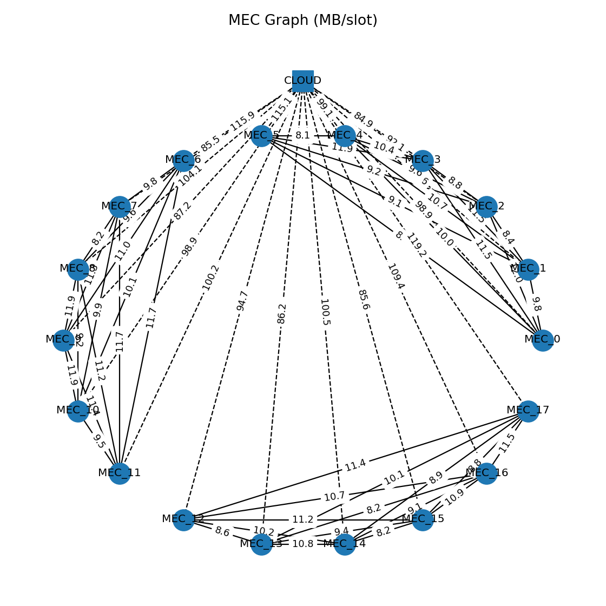

# Topology Report

- **Servers (MEC)**: 18
- **Time step (Δ)**: 1.0 seconds
- **Topology type**: clustered, **skip_k**: 5, **symmetric**: True, **num_clusters**: 3

## Compute Capacities (CPU cycles per slot)
- Private (per MEC): min=1.22e+09, mean=1.5e+09, max=1.79e+09
- Public  (per MEC): min=5.02e+08, mean=7.07e+08, max=8.23e+08
- Cloud (single): 3e+10

## Link Capacities (MB per slot)
- Horizontal MEC↔MEC (non-zero entries): 90
- MEC→Cloud (length K): min=84.9, mean=99, max=119

## Graph

## Notes
- Values are per slot; per-slot = per-second × Δ.
- Units: compute=CPU cycles per slot, links=MB per slot, time_step=seconds.