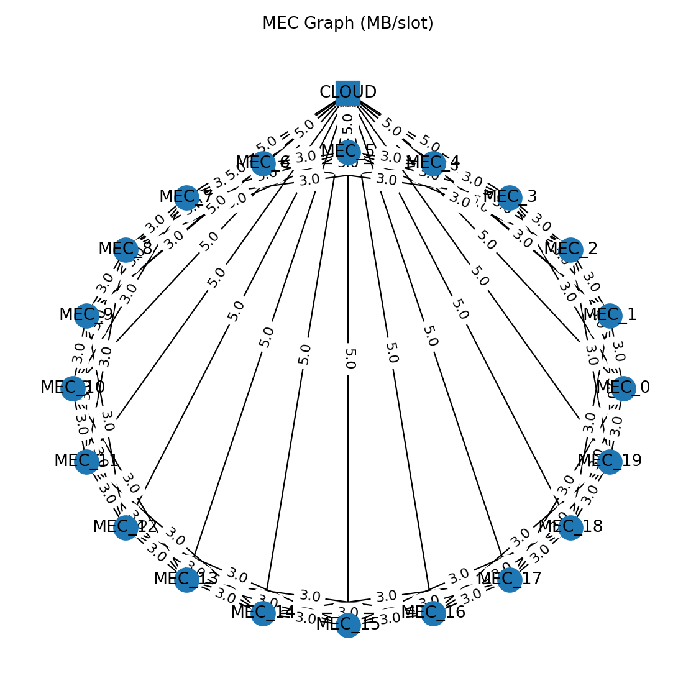

# Topology Report

- **Servers (MEC)**: 20
- **Topology type**: skip_connections
- **Link density (MEC↔MEC)**: 0.316

## Compute Capacities
- Private: [5.0, 5.0, 5.0, 5.0, 5.0, 5.0, 5.0, 5.0, 5.0, 5.0, 5.0, 5.0, 5.0, 5.0, 5.0, 5.0, 5.0, 5.0, 5.0, 5.0]
- Public:  [5.0, 5.0, 5.0, 5.0, 5.0, 5.0, 5.0, 5.0, 5.0, 5.0, 5.0, 5.0, 5.0, 5.0, 5.0, 5.0, 5.0, 5.0, 5.0, 5.0]
- Cloud:   30.0

## Link Capacities
- MEC↔MEC bandwidth: 3.0
- MEC→Cloud bandwidth: 5.0
- MEC→Cloud stats: min=5, mean=5, max=5

## Graph

