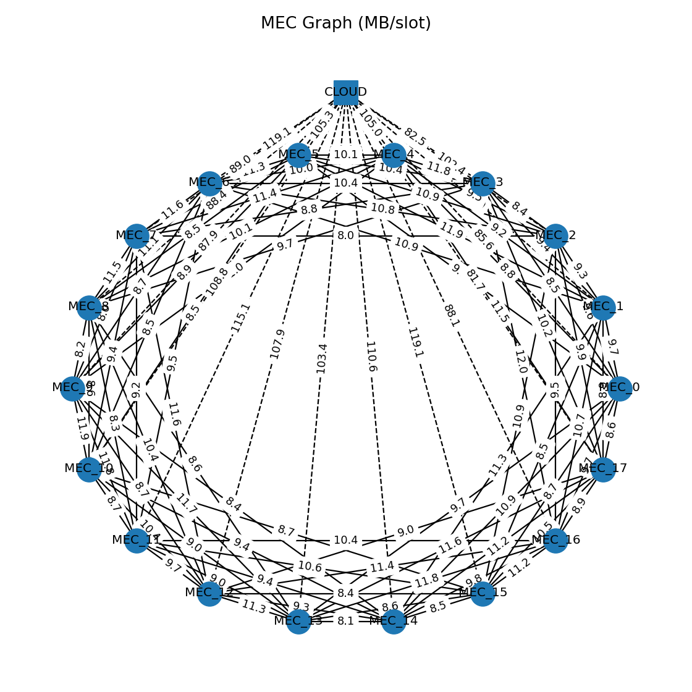

# Topology Report

- **Servers (MEC)**: 18
- **Time step (Δ)**: 1.0 seconds
- **Topology type**: skip_connections, **skip_k**: 5, **symmetric**: True

## Compute Capacities (CPU cycles per slot)
- Private (per MEC): min=1.2e+09, mean=1.49e+09, max=1.78e+09
- Public  (per MEC): min=5.47e+08, mean=6.95e+08, max=8.64e+08
- Cloud (single): 3e+10

## Link Capacities (MB per slot)
- Horizontal MEC↔MEC (non-zero entries): 180
- MEC→Cloud (length K): min=81.7, mean=99.2, max=119

## Graph

## Notes
- Values are per slot; per-slot = per-second × Δ.
- Units: compute=CPU cycles per slot, links=MB per slot, time_step=seconds.